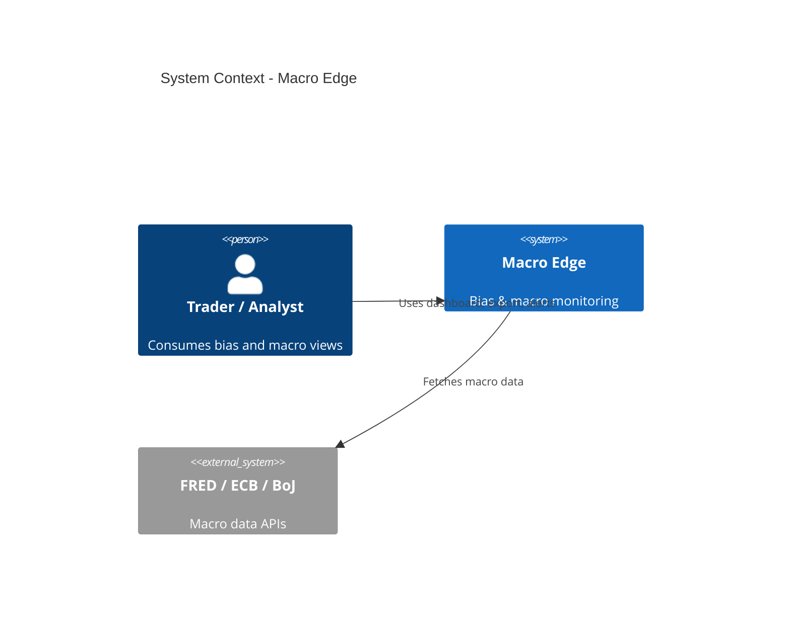
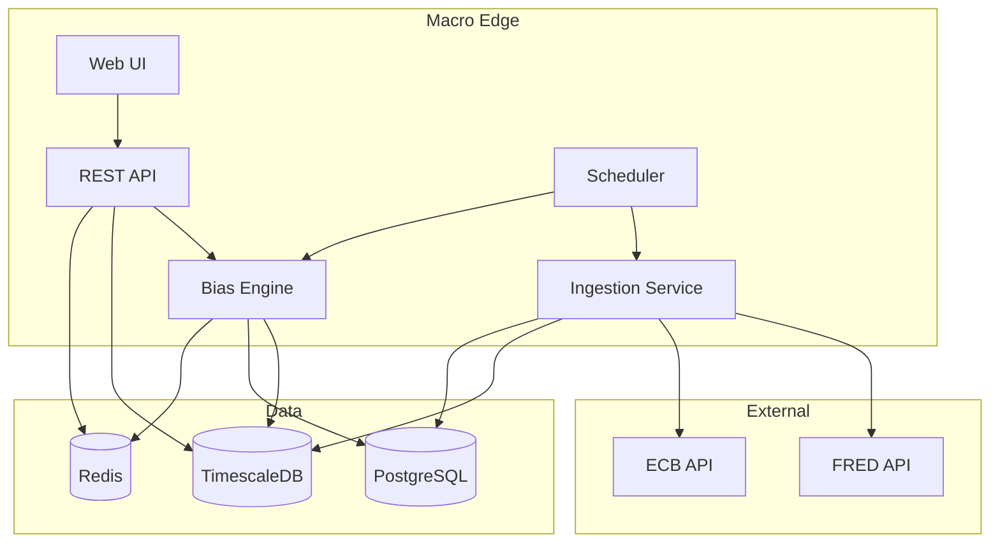
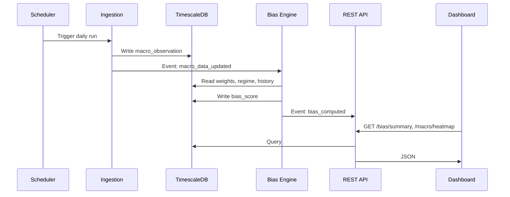
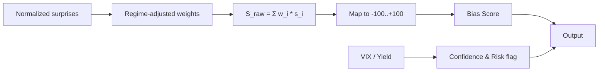
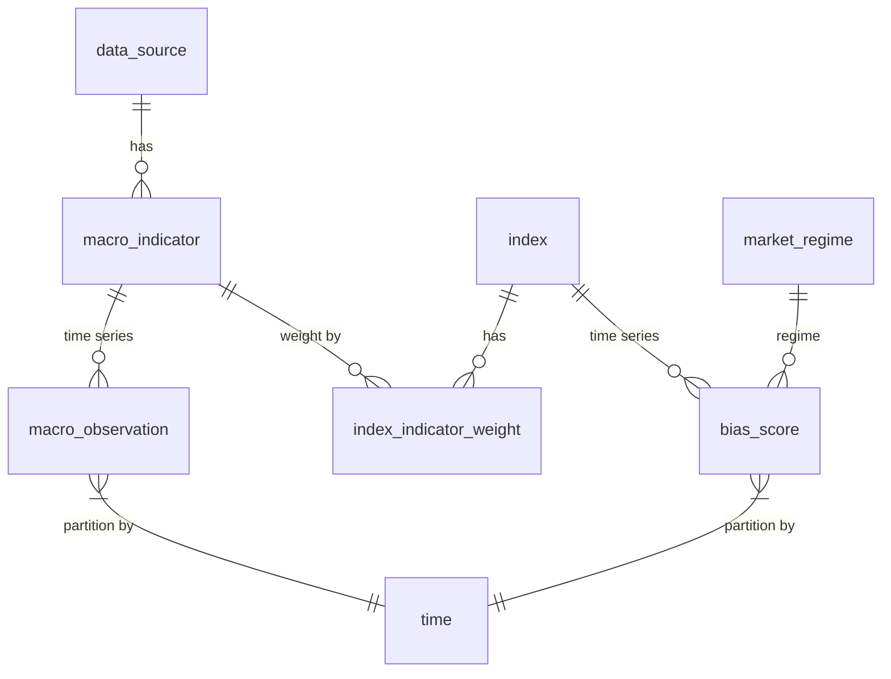

# Architecture & Data Flow Diagrams (Mermaid)

## System Context

## Container Diagram (High Level)

## Data Flow (Simplified)

## Bias Scoring Flow (Logic)

## Database ER (Simplified)

These diagrams can be rendered in any Mermaid-compatible viewer (e.g. GitHub, GitLab, or VS Code with a Mermaid extension).
